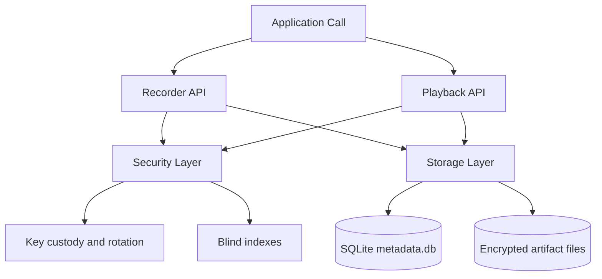
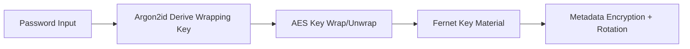
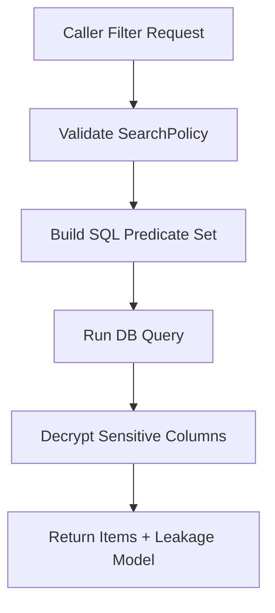
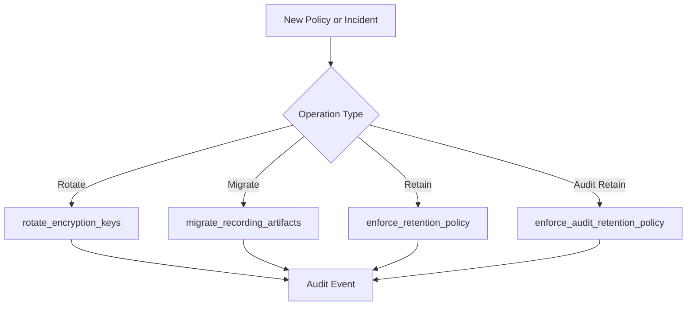
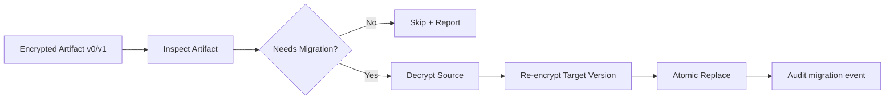

# SecureMeet Recorder


SecureMeet is a local-first recording library built for teams that need strong data-at-rest controls without introducing a full remote service stack. The library captures audio, writes encrypted artifact containers to disk, stores encrypted metadata with blind indexes, and provides playback plus search APIs that are explicit about what is and is not queryable. The design goal is practical confidentiality with operational clarity, not magic encryption where tradeoffs are hidden.

This document is intentionally long and detailed because SecureMeet is not just a file writer. It is a small security architecture with lifecycle controls, policy-driven filtering, key custody options, audit trails, migration paths, and explicit leakage semantics. If you are integrating SecureMeet into regulated or high-sensitivity workflows, understanding those boundaries is part of using the package correctly.

> [!IMPORTANT]
> SecureMeet protects recordings and sensitive metadata at the application layer. It does not replace host hardening, endpoint detection, account isolation, physical security, and incident response controls.

> [!NOTE]
> Current storage behavior uses a chunked ChaCha20-Poly1305 artifact format for recording payloads and Fernet/MultiFernet for metadata field protection and rotation compatibility. This split is deliberate: chunking improves large-file handling while Fernet keeps metadata lifecycle operations simple and auditable.

## Table Of Contents

- [At A Glance](#at-a-glance)
- [Top-Level Comparison Tables](#top-level-comparison-tables)
- [Tech Stack And Architecture](#tech-stack-and-architecture)
- [Algorithm And Formula Rationale](#algorithm-and-formula-rationale)
- [Search Policy, Leakage Model, And Query Semantics](#search-policy-leakage-model-and-query-semantics)
- [Lifecycle Controls: Rotation, Migration, Retention, Audit](#lifecycle-controls-rotation-migration-retention-audit)
- [Collapsible API Reference](#collapsible-api-reference)
- [Security Review, Tips, And Operational Notes](#security-review-tips-and-operational-notes)
- [Research, Standards, And Further Reading](#research-standards-and-further-reading)
- [Bottom Visual Notes](#bottom-visual-notes)

## At A Glance

SecureMeet is designed for applications that need encrypted local recording with inspectable behavior and predictable APIs. It is strongest when you want explicit control over cryptographic lifecycle events such as key rotation, artifact migration, and retention cleanup. It is intentionally not a networked collaboration platform, and it does not claim to remove all leakage from searchable metadata.


Note paragraph 1: This top image is a simple high-level map of the control boundaries. The primary point is that plaintext audio remains transient in memory during capture and decode operations, while durable storage is encrypted. Teams evaluating architecture quickly can use this visual to align on the main security boundary before reviewing implementation details.

Note paragraph 2: The visual is intentionally opinionated about flow direction because lifecycle order matters. In SecureMeet, controls are sequenced, not independent. Capture and encoding happen before artifact encryption, and retention or migration happens after metadata commit, which keeps state transitions deterministic and easier to audit.

> [!TIP]
> Read this README from top to bottom once before integrating. The package intentionally exposes operational knobs, and default assumptions may not match your threat model.

## Top-Level Comparison Tables

### Table 1 - When To Use SecureMeet And When Not To Use It

| # | Scenario | Use SecureMeet | Do Not Use SecureMeet Alone | Why |
| --- | --- | --- | --- | --- |
| 1 | Local regulated meeting capture | Yes | No, if remote multi-party sync is mandatory | SecureMeet is local-first and optimized for encrypted local archives, not distributed collaboration. |
| 2 | Desktop recorder with compliance retention requirements | Yes | No, if immutable evidence ledger is required | It supports retention and audit events, but not append-only notarized ledgers. |
| 3 | Embedded Python workflow with strict auditability | Yes | No, if no Python runtime is allowed | The architecture is intentionally Python-native and tightly integrated with Python libs. |
| 4 | Zero-trust searchable cloud database | No | No | SecureMeet blind indexes are useful locally but are not a full searchable encrypted DB platform. |
| 5 | Air-gapped local archive process | Yes | No, if host controls are weak | Application-layer encryption helps, but compromised hosts can still expose in-memory plaintext. |
| 6 | High-scale multi-tenant service | Maybe | No, if strict tenant isolation and centralized KMS are required | You can build around it, but SecureMeet itself is not a complete multi-tenant platform. |

### Table 2 - Feature Differences, What They Do, And When Not To Use Each

| # | Feature | What It Does | When To Use | When Not To Use | Main Difference From Similar Features |
| --- | --- | --- | --- | --- | --- |
| 1 | Chunked encrypted artifact | Encrypts recording bytes in chunks using AEAD | Large recordings and partial reads | Tiny one-shot files where simplicity outweighs chunking | Built for stream-like handling, unlike whole-message tokens |
| 2 | Encrypted metadata fields | Protects sensitive DB columns | Path/hash/timestamp confidentiality | Workflows that require plaintext SQL text search | Encrypts content while still allowing controlled decode in app layer |
| 3 | Blind index filtering | Supports equality checks on sensitive fields | Exact `sha256` or `filename` lookups | Prefix/fuzzy/range search on sensitive strings | Trades some leakage for exact-match utility |
| 4 | Search policy object | Restricts which fields are queryable/sortable | Governance-heavy deployments | Ad-hoc unrestricted querying environments | Makes leakage surface explicit and configurable |
| 5 | Rotation API | Re-wraps persisted encrypted values under new key | Periodic hygiene and post-incident recovery | Systems with static non-rotating keys by policy | Updates both ciphertext and derived index material |
| 6 | Artifact migration API | Upgrades old containers to current version | Version drift and rolling upgrades | One-time throwaway archives | Maintains compatibility while moving to safer defaults |
| 7 | Audit retention policy | Keeps audit table bounded by age/count | Long-running deployments | Tiny ephemeral tests where audit history is irrelevant | Applies lifecycle controls specifically to audit stream |
| 8 | Streaming playback API | Plays without full decode into one giant buffer | Memory-constrained playback workflows | Extremely latency-sensitive low-level audio engines with custom pipelines | Uses callback stream with decrypted block reads |

### Table 3 - Step-By-Step Write Path And Why Each Step Exists

| Step | Stage | What Happens | Why It Is Needed | If Skipped |
| --- | --- | --- | --- | --- |
| 1 | Capture | Audio frames are collected from backend | This is the source signal for recording | No recording exists |
| 2 | Encode | WAV payload is built | Standardized container for downstream decode compatibility | Playback interoperability drops |
| 3 | Encrypt artifact | WAV bytes are wrapped into chunked AEAD container | Keeps audio confidential and tamper-detectable at rest | Plaintext recording is exposed on disk |
| 4 | Hash | SHA-256 hash is computed over plaintext WAV | Stable content identity for search/audit checks | You lose simple integrity tracking and dedupe signal |
| 5 | Encrypt metadata fields | Sensitive metadata columns are encrypted | Prevents straightforward DB-page scraping | Filename/hash/timestamp leak in plaintext |
| 6 | Compute blind indexes | HMAC digest columns are stored | Enables exact-match search over protected fields | Sensitive lookups require full scans/decrypts |
| 7 | Commit row | Record is persisted to SQLite | Durable linkage between artifact and metadata | Orphaned files or untracked artifacts become likely |
| 8 | Enforce retention | Old/excess artifacts and rows are deleted | Keeps dataset bounded by policy | Storage and compliance risk grows over time |

## Tech Stack And Architecture

SecureMeet keeps dependencies intentionally focused to reduce audit surface and accidental complexity. The audio stack is built around sounddevice and soundfile, persistence is SQLite, and cryptographic operations use the Python cryptography library. This lets the project stay local-first while still offering strong authenticated encryption and explicit lifecycle APIs.

The architecture uses clear ownership boundaries. Recorder and playback APIs focus on audio behavior and caller ergonomics. Storage owns schema, migration, search filtering, retention, and audit persistence. Security owns key normalization, encryption/decryption primitives, blind indexes, key wrapping, and password custody. This separation allows deeper review of each layer without blending concerns.

### Table 4 - Tech Stack Selection Matrix

| Area | Chosen Component | Why Chosen | Strong Alternative | Why Alternative Was Not Default |
| --- | --- | --- | --- | --- |
| Audio capture/playback | sounddevice | Cross-platform API with minimal integration overhead | PyAudio, GStreamer | More setup complexity and larger runtime surface for this library scope |
| Audio container IO | soundfile | Efficient file-like WAV reads/writes, supports block processing | wave module | wave is simpler but less ergonomic for streaming and dtype conversions |
| Local metadata DB | sqlite3 | Built-in, file-based, easy backup semantics | PostgreSQL, DuckDB | Remote DB adds operational overhead and networked threat assumptions |
| Artifact encryption | ChaCha20-Poly1305 | Fast AEAD with simple nonce model for chunking | AES-GCM | Either can work; ChaCha is a strong default on varied CPU profiles |
| Metadata token encryption | Fernet/MultiFernet | Stable token format + built-in rotation support | Custom AES-GCM token format | Custom format increases implementation and review burden |
| Password custody | Argon2id + AES key wrap | Memory-hard KDF plus standard wrapping primitive | PBKDF2 + direct key derivation | PBKDF2 is widely used but offers weaker GPU resistance than Argon2id |
| Protected search | HMAC-SHA256 blind index | Exact-match queries with controlled disclosure | Deterministic encryption | Deterministic ciphertext equality leakage is more direct |




Note paragraph 1: This middle image emphasizes architectural layering rather than algorithm detail. The most common integration risk in security projects is blending policy and transport concerns into one module. By visualizing boundaries, reviewers can evaluate responsibilities independently and identify where controls should be tested.

Note paragraph 2: The architecture map is also useful for incident response planning. If a defect appears in filtering semantics, storage and policy logic are the first investigation area. If a defect appears in key handling or ciphertext conversion, security helpers are the primary surface. Explicit layer boundaries reduce mean-time-to-diagnosis.

> [!IMPORTANT]
> Keep key handling outside business logic. Callers should pass key material via controlled config paths and rotate according to policy, not by ad-hoc per-feature decisions.

## Algorithm And Formula Rationale

SecureMeet uses multiple cryptographic primitives because each one solves a different problem. ChaCha20-Poly1305 provides authenticated encryption for chunked audio payloads. Fernet/MultiFernet provides stable metadata token handling and a straightforward rotation API. Argon2id with AES key wrap supports password-protected local custody for encryption keys. HMAC-SHA256 blind indexes support exact-match search on sensitive fields with bounded, explicit leakage.

A single primitive for everything would be simpler to explain, but less appropriate in practice. The implementation chooses primitives based on workload and lifecycle behavior rather than stylistic consistency alone.

### Table 5 - Algorithm Choice, Tradeoffs, And Why Not Something Else

| Need | Chosen Algorithm/Mechanism | Why Chosen | Alternative | Why Not Default |
| --- | --- | --- | --- | --- |
| Chunked artifact confidentiality + integrity | ChaCha20-Poly1305 | AEAD with straightforward chunk-by-chunk nonce derivation and fast software performance | AES-GCM | AES-GCM is solid, but ChaCha is often more predictable across CPU features |
| Metadata field protection | Fernet | Simple authenticated token API with stable ecosystem usage | Custom AEAD tokens | Custom token framing adds maintenance and review burden |
| Key rotation | MultiFernet rotate | Built-in and clear API semantics | Hand-rolled decrypt-reencrypt logic | Custom rotation code has higher defect risk |
| Password custody | Argon2id + AES key wrap | Memory-hard KDF plus standardized wrapping primitive | PBKDF2 or scrypt variations | Argon2id is preferred modern default for password-derived key hardening |
| Equality search on sensitive values | HMAC-SHA256 blind index | Stable exact-match lookup with keyed digest | Deterministic encryption | Deterministic encryption exposes equality patterns directly in ciphertext |
| Artifact migration compatibility | Versioned container header | Explicit forward migration path | Implicit format inference | Hidden format transitions are harder to validate in production |

### Practical Formula Notes

The formulas below are engineering approximations used for planning and reasoning, not formal security proofs.

1. Blind-index collision intuition:

$$
\mathbb{E}[\text{collisions}] \approx \frac{r}{2^n}
$$

Where $r$ is approximate row count and $n$ is digest bit length.

2. Chunked artifact size estimate:

$$
	ext{artifact\_bytes} \approx \text{header} + \sum_{i=1}^{k}(4 + c_i + 16)
$$

Each chunk stores a 4-byte length prefix, ciphertext payload $c_i$, and a 16-byte AEAD tag.

3. Retention overflow by count:

$$
	ext{delete\_count} = \max(0, \text{current\_items} - \text{max\_recordings})
$$

4. Argon2id cost planning heuristic:

$$
	ext{work\_factor} \propto \text{iterations} \times \text{memory\_cost} \times \text{lanes}
$$

This relation is qualitative and used for policy tuning conversations, not as a benchmark substitute.



> [!NOTE]
> The custody path is intentionally separate from artifact encryption internals. Password handling should be auditable and bounded rather than mixed into every record/read call.

## Search Policy, Leakage Model, And Query Semantics

Search in encrypted systems is always a tradeoff between privacy and utility. SecureMeet makes this explicit through a SearchPolicy object that defines which fields remain filterable in plaintext, which fields are only filterable through blind indexes, and which fields are sortable. This helps teams document and enforce acceptable leakage instead of leaving behavior implicit.

The library also returns leakage model metadata for paginated search, so callers can log or display the effective query surface. That is helpful during compliance reviews because reviewers can tie actual API behavior to written policy.

### Table 6 - Search Surface And Leakage Characteristics

| Field | Storage Form | Query Type | Allowed By Default | Leakage Characteristic | Why This Is Acceptable In Default Policy |
| --- | --- | --- | --- | --- | --- |
| id | Plain integer | Equality/list | Yes | Row identity and cardinality | Needed for stable record addressing and pagination |
| duration_seconds | Plain numeric | Range/equality | Yes | Duration distribution | Operationally useful for filtering playback candidates |
| samplerate | Plain numeric | Equality | Yes | Format profile leakage | Needed for compatibility and quality selection |
| channels | Plain numeric | Equality | Yes | Channel-count visibility | Low sensitivity in most meeting recording contexts |
| frames | Plain numeric | Range/equality | Yes | Size approximation | Required for partial-read and buffering workflows |
| file_size_bytes | Plain numeric | Range/equality | Yes | Payload size profile | Retention and storage budget control require it |
| created_at_epoch | Plain numeric | Range | Yes | Temporal distribution | Required for retention windows and timeline queries |
| logged_at | Plain timestamp | Range/sort | Yes | Event sequence visibility | Needed for deterministic operational ordering |
| filename | Encrypted + blind index | Equality only | Yes | Equality pattern under keyed digest | Better than plaintext path storage |
| sha256 | Encrypted + blind index | Equality only | Yes | Equality pattern under keyed digest | Enables exact integrity lookups without plaintext hash |




Note paragraph 1: This middle image helps teams explain to auditors why some fields remain plaintext-filterable while others are blind-indexed. Query practicality and leakage minimization are competing constraints, so policy has to state where the boundary is. The visual makes the policy boundary easier to communicate than a purely textual description.

Note paragraph 2: The most important operational discipline is consistency. If one integration path bypasses policy validation and constructs raw SQL predicates directly, the leakage model becomes inaccurate. For that reason, query construction should stay inside storage helpers that enforce SearchPolicy semantics.

> [!WARNING]
> Blind indexes are not zero-leakage search. They reduce sensitive disclosure compared with plaintext fields, but equality patterns can still leak structure.

## Lifecycle Controls: Rotation, Migration, Retention, Audit

SecureMeet lifecycle controls address different classes of risk. Rotation addresses key age and compromise blast radius. Migration addresses container version drift and long-term compatibility. Retention addresses data minimization and storage ceilings. Audit addresses operational observability, including failures like missing artifacts or decrypt errors.

Treating these as one combined control is a common architecture mistake. Each control needs separate policy thresholds, separate review cadence, and separate testing scenarios.

### Table 7 - Lifecycle Controls, Triggers, And Failure Modes

| Control | API Surface | Typical Trigger | Success Condition | Failure Signal | Recovery Path |
| --- | --- | --- | --- | --- | --- |
| Key rotation | rotate_encryption_keys | Scheduled rotation window or post-incident | Files and metadata re-wrapped under new primary key | Key rotation audit event with error status | Roll back from backup artifacts and retry with corrected keyset |
| Artifact migration | migrate_recording_artifacts | New container version rollout | Target artifacts upgraded to requested version | Artifact migration audit event with error status | Retry by recording ID after investigating affected file |
| Recording retention | enforce_retention_policy | After inserts or scheduled cleanup | Items satisfy age/count/size bounds | Unexpected deletion or orphan checks | Restore from backup archive if policy too aggressive |
| Audit retention | enforce_audit_retention_policy | Scheduled audit DB hygiene | Audit table bounded by policy | Missing expected audit history | Increase max_events/max_age_days and adjust retention cadence |
| Missing artifact detection | load/play/delete/rotate paths | File removed externally or path drift | Warning or error audit event logged | missing_file_artifact event | Reconcile DB state and artifact filesystem paths |
| Decrypt integrity detection | load/play paths | Tampered ciphertext or wrong key | Error path raises and logs decrypt failure | decrypt_failure event | Validate keys, restore artifact, rotate if compromise suspected |





> [!CAUTION]
> Rotation and migration can be expensive on large archives. Run these operations with explicit change windows and post-operation validation in place.

## Collapsible API Reference

<details>
<summary>Core API Families</summary>

SecureMeet public APIs are grouped into key management, recording, search, playback, lifecycle, and audit families. Keeping these families separate in integration code improves readability and makes policy boundaries easier to enforce. The examples below show minimal usage with clear intent.

```python
from securemeet import (
    RetentionPolicy,
    create_password_protected_key,
    fetch_audit_events,
    generate_encryption_key,
    load_recording,
    play_recording,
    record_meeting,
    rotate_encryption_keys,
    search_recordings_page,
    unlock_password_protected_key,
)

primary = generate_encryption_key()
protected = create_password_protected_key("strong-passphrase", encryption_key=primary)
resolved_key = unlock_password_protected_key("strong-passphrase", protected)

path = record_meeting(
    duration_seconds=30,
    folder="recordings",
    samplerate=44100,
    channels=1,
    encryption_keys=resolved_key,
    retention_policy=RetentionPolicy(max_recordings=100, max_age_days=30),
)

page = search_recordings_page(
    base_folder="recordings",
    encryption_keys=resolved_key,
    page=1,
    page_size=20,
)

data, rate = load_recording(path=path, encryption_keys=resolved_key)
play_recording(path=path, encryption_keys=resolved_key)

summary = rotate_encryption_keys(
    new_primary_key=generate_encryption_key(),
    base_folder="recordings",
    encryption_keys=resolved_key,
)

audit = fetch_audit_events(base_folder="recordings", encryption_keys=resolved_key)
```

</details>

<details>
<summary>Detailed API Matrix</summary>

### Table 8 - Public API Matrix With Intent And Side Effects

| Function | Category | Main Inputs | Main Outputs | Side Effects | Why You Need It |
| --- | --- | --- | --- | --- | --- |
| generate_encryption_key | Key management | none | Fernet key string | none | Creates fresh encryption key material |
| create_password_protected_key | Key custody | password, optional key | serialized custody bundle | none | Stores key material safely behind password-derived wrapping |
| unlock_password_protected_key | Key custody | password, custody bundle | Fernet key string | none | Recovers key at runtime for active operations |
| record_meeting | Recording | duration, folder, audio params, keys, retention policy | encrypted artifact path | writes artifact + metadata row + optional retention delete | Primary ingestion API |
| fetch_recordings | Metadata | folder, keys | decrypted rows | may trigger schema initialization/migration | Fast metadata listing |
| get_recording | Metadata | recording id, folder, keys | one decrypted row or none | none | Direct lookup by ID |
| search_recordings | Metadata search | filters, policy, keys | filtered decrypted rows | none | Non-paginated convenience search |
| search_recordings_page | Metadata search | filters, policy, pagination options | items + paging + leakage model | none | Controlled paging and policy-aware sorting |
| load_recording_bytes | Playback/data | encrypted path, keys | plaintext WAV bytes | decrypt audit on failure paths | Byte-level access for custom pipelines |
| load_recording | Playback/data | id or path, folder, keys | sample array + sample rate | decrypts and decodes | Programmatic playback or analytics |
| play_recording | Playback | id or path, folder, keys | summary dict | sends audio to backend | Blocking/non-blocking local playback |
| rotate_encryption_keys | Lifecycle crypto | new key, folder, old keyset | rotation summary | rewrites encrypted artifacts and metadata | Limits blast radius of older keys |
| fetch_audit_events | Audit | filters, pagination, keys | decrypted audit page | none | Observability and compliance review |
| init_db | Persistence setup | folder, keys | DB path | creates/updates schema | Explicit initialization and migration point |

</details>

<details>
<summary>Streaming And Partial Read Notes</summary>

Partial read and streaming helpers are designed for memory-aware playback flows. They allow range-based frame reads and block iteration over decrypted content, reducing pressure from full-file decode in caller code. For long recordings and constrained environments, these helpers are often safer and easier to monitor than ad-hoc in-memory buffering.

These helpers still require plaintext blocks in process memory during active playback, so host security remains critical. Their value is bounded memory behavior and cleaner I/O patterns, not elimination of runtime plaintext exposure.

</details>

## Security Review, Tips, And Operational Notes

SecureMeet is explicit about residual risk. Application-layer encryption materially improves data-at-rest posture, but it does not remove runtime memory exposure during capture, playback, migration, and rotation. Search leakage is reduced, not eliminated. Deletion behavior is practical, not forensic-grade secure erase on all filesystems.

### Table 9 - Threats, Controls, Residual Risk, And Operator Tips

| Threat | Current Control | Residual Risk | Operator Tip |
| --- | --- | --- | --- |
| Offline disk theft | Encrypted artifacts and encrypted sensitive metadata | Operational fields still visible in DB | Pair with full-disk encryption and strict account permissions |
| Ciphertext tampering | AEAD tags plus Fernet authentication | Runtime compromise can still manipulate process behavior | Monitor decrypt_failure events and investigate quickly |
| Key compromise | Rotation API and keyset strategy | Data remains exposed until rotation completes | Define rotation SLA and rehearse incident rotation |
| Excessive retention | Retention policies for artifacts and audit events | Wrong policy values can over-delete or under-delete | Stage policy changes in test archive first |
| Search leakage | Blind indexes + policy restrictions | Equality patterns may still leak structure | Restrict blind-index fields to minimal set |
| Missing artifact drift | Audit events for missing file paths | External file manipulation can still happen | Add periodic integrity reconciliation jobs |
| Legacy data exposure | Automatic schema migration | Backups may still include old plaintext states | Protect backup media with separate controls |
| Runtime memory inspection | Local process boundary assumptions | Plaintext exists during active operations | Harden host endpoints and minimize privileged access |

> [!IMPORTANT]
> Treat key governance, backup policy, and host hardening as first-class requirements. Application-layer encryption is one component, not the entire control plane.

> [!TIP]
> Keep separate environments and keys for development, staging, and production archives. Shared keys across environments reduce incident containment options.


Note paragraph 1: This near-bottom image focuses on operations because secure software fails most often in lifecycle execution, not in primitive selection. A correct algorithm can still be undermined by weak key rotation discipline, poor monitoring response, or silent drift in retention policies. The visual highlights those repeatable operational motions.

Note paragraph 2: Teams should convert this visual into a real runbook. That runbook should define owners, response times, escalation criteria, and evidence artifacts for each security event class. The technical API surface becomes significantly safer when tied to explicit operational accountability.

## Research, Standards, And Further Reading

SecureMeet design choices align with practical guidance from cryptography documentation, OWASP guidance, and searchable-encryption research. The references below are useful both for implementation understanding and for policy discussion with auditors.

### Table 10 - Research And Standard Mapping

| Topic | Why It Matters Here | Reference |
| --- | --- | --- |
| Fernet/MultiFernet semantics | Clarifies token guarantees and rotation behavior | https://cryptography.io/en/latest/fernet/ |
| Argon2 guidance | Helps tune memory-hard password custody settings | https://datatracker.ietf.org/doc/html/rfc9106 |
| OWASP key lifecycle guidance | Practical key management controls and anti-patterns | https://cheatsheetseries.owasp.org/cheatsheets/Key_Management_Cheat_Sheet.html |
| Searchable encryption leakage tradeoffs | Frames utility-vs-leakage design decisions | https://doi.org/10.1145/2043556.2043566 |
| Blind index systems perspective | Discusses blind index and proxy-mediated query patterns | https://eprint.iacr.org/2019/806 |
| Modern blind index + TEE discussion | Recent arXiv context for blind index tradeoffs | https://arxiv.org/abs/2411.02084 |
| Leakage exploitation reality | Demonstrates practical attacks from structured leakage | https://doi.org/10.1109/SP.2019.00030 |
| AEAD mode recommendations | Broader context for authenticated encryption choices | https://csrc.nist.gov/publications/detail/sp/800-38d/final |

> [!NOTE]
> Recommended reading order: implementation docs first, lifecycle guidance second, research literature third. This sequence keeps architecture discussions concrete and avoids over-fitting design to a single paper.

## Bottom Visual Notes


Note paragraph 1: This final image is meant for review ceremonies and release checklists. It reminds teams to validate leakage policy boundaries, confirm audit retention behavior, and verify key custody handling before production rollout. Security failures often emerge in release transitions where assumptions go unchecked.

Note paragraph 2: The checklist framing also helps cross-functional communication. Engineers, security reviewers, and compliance stakeholders can all map their responsibilities to concrete controls in this library. Shared language reduces friction and leads to faster, more accurate reviews.

> [!WARNING]
> If your threat model includes live host compromise, memory scraping, privileged malware, or insider abuse with runtime access, SecureMeet alone is not sufficient. Combine it with hardened hosts, mandatory access controls, strong identity boundaries, and continuous monitoring.

> [!TIP]
> For long-running deployments, schedule quarterly architecture reviews where you revisit SearchPolicy defaults, Argon2id parameters, and retention thresholds against current risk and performance data.
