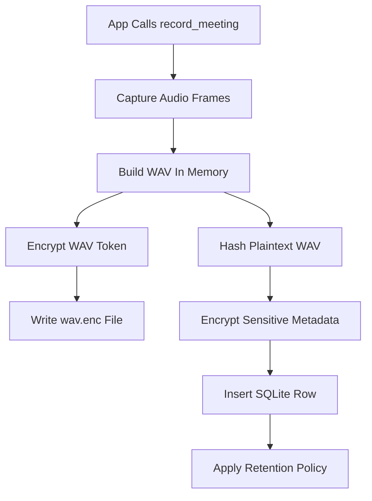
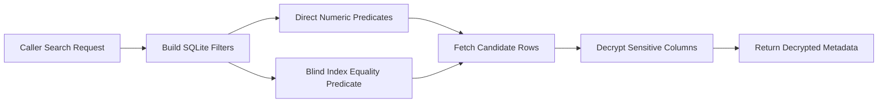
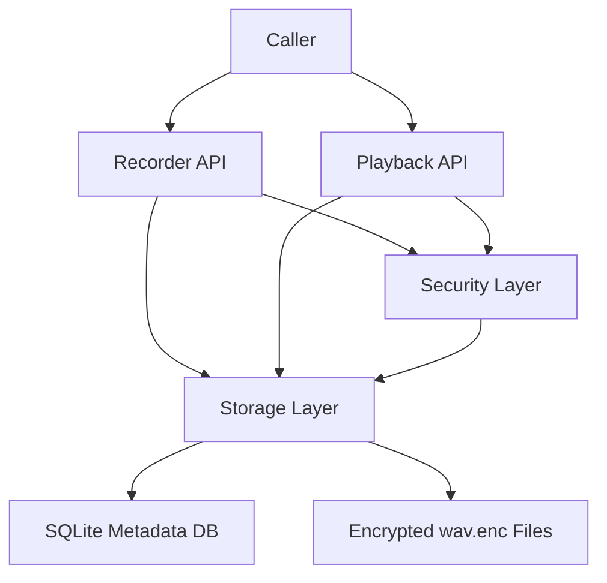
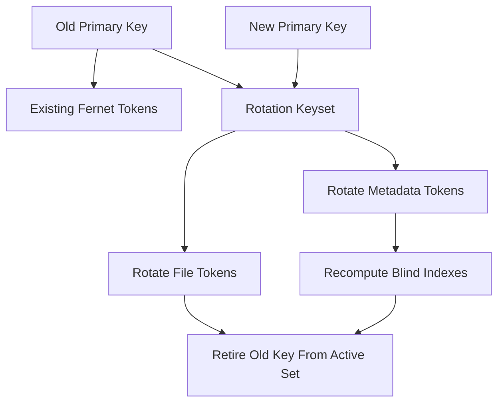
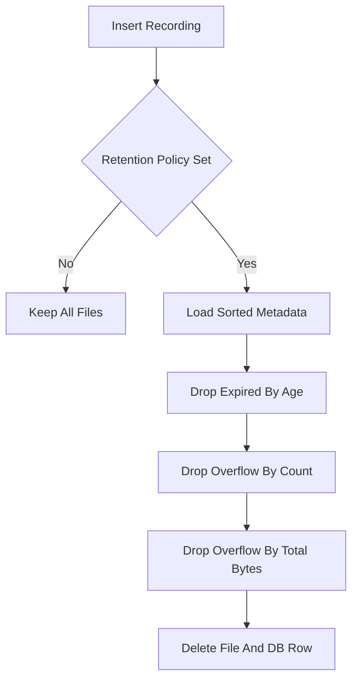
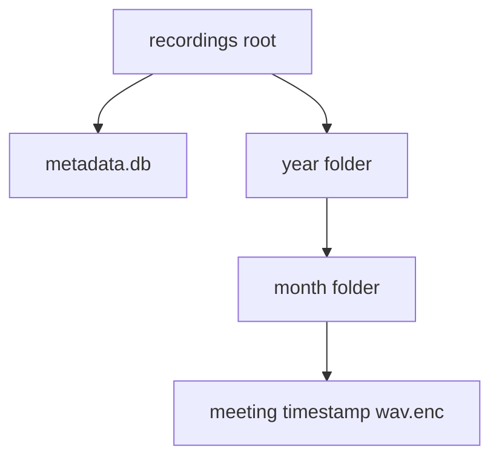

# SecureMeet Recorder


SecureMeet is a local-first Python recording library for security-sensitive meeting capture. It records microphone input, serializes it into WAV format in memory, encrypts the resulting payload before it reaches disk, and stores searchable metadata in SQLite without leaving sensitive fields in plaintext. The package is intentionally small, auditable, and focused on application integration through Python APIs rather than operator-facing tooling.

This README is intentionally detailed because the package is doing more than file I/O. It combines audio capture, authenticated encryption, searchable protected metadata, playback, retention enforcement, and key rotation. Each of those concerns has different tradeoffs, and understanding them is part of using the library safely.

> [!IMPORTANT]
> SecureMeet protects data at rest inside the application boundary. It does not replace host hardening, disk encryption, access control, secrets management, or endpoint monitoring.
> [!NOTE]
> The current implementation uses Fernet tokens for encrypted files and encrypted metadata fields. Fernet is a strong fit for small to medium payloads that fit in memory, but it is not a streaming file format. That limitation directly shapes the architecture and is called out again later.

## Table Of Contents

- [What SecureMeet Is For](#what-securemeet-is-for)
- [Quick Comparison](#quick-comparison)
- [How The System Works](#how-the-system-works)
- [Tech Stack And Architecture](#tech-stack-and-architecture)
- [Cryptography Choices](#cryptography-choices)
- [Search Model And Blind Indexing](#search-model-and-blind-indexing)
- [Rotation And Retention](#rotation-and-retention)
- [API Reference](#api-reference)
- [Security Review](#security-review)
- [Research And Standards](#research-and-standards)

## What SecureMeet Is For

SecureMeet is designed for applications that need local recording with stronger data-at-rest protections than plain filesystem writes and plain SQLite tables. It is useful when you need application-level control over recording storage, when you need simple playback and search APIs, and when you want a codebase that is easier to audit than a large service stack.

It is not a full secure communications platform, and it is not a privacy-preserving cloud synchronization system. The library stores data locally and assumes the caller is responsible for key provisioning, host hardening, user permissions, and lifecycle policy decisions.

| # | Scenario | Use SecureMeet | Do Not Use SecureMeet Alone | Why |
| --- | --- | --- | --- | --- |
| 1 | Local regulated meeting capture | Yes | No, if remote collaboration is required | It gives local encryption, metadata search, and retention controls without adding network services. |
| 2 | Desktop or kiosk recorder | Yes | No, if hostile local admins are in scope | The package protects files at rest, but a compromised host can still inspect process memory during playback or recording. |
| 3 | Small embedded workflow with Python integration | Yes | No, if strict memory ceilings are required | Fernet operates on whole messages, so recordings are encrypted after the WAV payload is assembled in memory. |
| 4 | Centralized multi-user encrypted database service | Maybe | No, if server-side zero-trust search is required | SecureMeet uses local SQLite and application-layer blind indexes, not a distributed encrypted query system. |
| 5 | Auditable offline incident archive | Yes | No, if immutable append-only evidence storage is required | It supports hashes, retention, and rotation, but it does not provide tamper-evident ledger semantics. |

GitHub note: This table explains where the library fits and where additional security systems are still required.

## Quick Comparison

The package now has several related features that look similar from the outside but solve different problems. The table below puts them next to each other so the separation of responsibilities stays clear.

| # | Capability | Protects | What It Does | When To Use | When Not To Rely On It |
| --- | --- | --- | --- | --- | --- |
| 1 | Encrypted WAV payloads | Audio content at rest | Writes `.wav.enc` instead of plaintext `.wav`. | Use for any recording that should not be readable from disk without the key. | Do not treat it as protection against live process compromise. |
| 2 | Encrypted metadata fields | Path, hash, and timestamp confidentiality | Stores sensitive fields as Fernet tokens inside SQLite. | Use when metadata itself is sensitive and plain SQLite pages are unacceptable. | Do not assume it hides every numeric attribute or row count. |
| 3 | Blind indexes | Searchability with reduced leakage | Stores keyed HMAC digests for exact-match filters. | Use for equality-style search such as SHA-256 lookup. | Do not use it for rich text search, prefix search, or ordered range search on encrypted strings. |
| 4 | Retention policy | Data minimization | Deletes old or excess recordings after inserts. | Use when storage ceilings and retention windows are part of the control model. | Do not equate deletion with secure erase on every filesystem. |
| 5 | Key rotation API | Operational crypto hygiene | Re-wraps stored tokens under a new primary key. | Use after key age, role changes, or suspected key exposure. | Do not postpone it indefinitely after a compromise signal. |
| 6 | Playback API | Usability | Decrypts a stored recording and returns or plays samples. | Use when the caller needs controlled local replay. | Do not expose playback in contexts where plaintext audio in memory is unacceptable. |

GitHub note: This table distinguishes the major controls so teams can map them to confidentiality, search, lifecycle, and operational goals.

## How The System Works

At a high level, SecureMeet keeps plaintext audio off disk during the normal record path. Audio frames are recorded from the local backend, encoded into WAV bytes in memory, encrypted as a Fernet token, and then written to a `.wav.enc` file. Metadata is stored in SQLite, but only non-sensitive numeric fields remain directly queryable, while sensitive fields such as filename, hash, and creation timestamp are encrypted.

The search path uses a split model. Numeric filters such as `duration_seconds`, `channels`, and `samplerate` are queried directly from SQLite because they are operational attributes that benefit from indexing. Sensitive equality checks, such as a SHA-256 match, use blind indexes so the database can filter rows without storing the underlying plaintext value.



This diagram shows the normal write path, where plaintext audio exists in process memory but does not become a plaintext filesystem artifact.



This diagram shows why blind indexing is paired with post-query decryption. SQLite performs coarse filtering, and SecureMeet returns fully decrypted metadata to the caller.

## Tech Stack And Architecture

SecureMeet uses a deliberately small Python stack so the behavior stays understandable. `sounddevice` handles local capture and playback, `soundfile` serializes audio samples and parses playback data, `sqlite3` stores metadata, and `cryptography` provides the authenticated encryption and multi-key rotation primitives.

The architecture is intentionally layered. Recorder and playback modules are thin audio-facing APIs, while storage owns the encrypted persistence model and security owns key normalization, encryption, decryption, blind indexing, and rotation keyset construction. This keeps security-sensitive logic out of UI or backend-specific calling code.

| # | Layer | Primary Module | Responsibility | Why This Split Matters |
| --- | --- | --- | --- | --- |
| 1 | Capture | `recorder.py` | Records frames, serializes WAV, invokes persistence. | Keeps microphone concerns separate from DB and crypto logic. |
| 2 | Playback | `playback.py` | Decrypts file tokens and replays or loads audio samples. | Makes plaintext re-entry explicit and auditable. |
| 3 | Persistence | `storage.py` | Owns schema, searches, migration, retention, deletion, and rotation. | Centralizes every rule that changes durable state. |
| 4 | Security | `security.py` | Normalizes keys, encrypts tokens, computes blind indexes, supports rotation. | Prevents crypto policy from being duplicated across modules. |
| 5 | Models | `metadata.py` | Defines metadata and retention configuration types. | Provides stable contracts between recorder and storage. |
| 6 | Utilities | `utils.py` | Creates paths and computes hashes. | Keeps low-level helpers out of policy-heavy code. |

GitHub note: This table maps the codebase to responsibilities so reviewers can find the correct control surface quickly.



This diagram shows the ownership boundaries. Security helpers are reused by storage and the audio-facing APIs instead of being reimplemented ad hoc.

### Technology Selection Matrix

| # | Choice | Selected | Why It Was Chosen | Why The Main Alternative Was Not Chosen Here |
| --- | --- | --- | --- | --- |
| 1 | Audio capture backend | `sounddevice` | It exposes a minimal Python API for microphone input and playback with broad desktop support. | Heavier media frameworks would add more dependencies and more audit surface. |
| 2 | Audio serialization | `soundfile` | It can write and read file-like objects, which enables in-memory WAV handling before encryption. | The standard `wave` module is simpler but less flexible for the existing sample pipeline. |
| 3 | Metadata store | `sqlite3` | It is built into Python and keeps the local deployment model simple. | A remote database would complicate threat boundaries and local-only assumptions. |
| 4 | File and field encryption | Fernet via `cryptography` | It provides authenticated symmetric encryption with a well-known API and key rotation support. | Raw AES-GCM would be more flexible but would require more custom nonce and format handling. |
| 5 | Exact-match protected search | HMAC blind index | It supports equality filtering without storing the plaintext value. | Deterministic encryption leaks equality more directly and ordered schemes leak even more structure. |
| 6 | DB encryption model | Application-layer encryption | It works with stock `sqlite3` and makes sensitive-field handling explicit in code. | Transparent DB encryption such as SQLCipher would shift the problem but also change deployment assumptions. |

GitHub note: This table explains both the positive choice and the rejected alternative, which is usually the missing part in short READMEs.

## Cryptography Choices

SecureMeet uses Fernet because the library needs authenticated encryption with minimal custom cryptographic framing. Fernet provides confidentiality and tamper detection in one token format, and `MultiFernet` provides a built-in way to rotate ciphertexts under a new primary key while preserving the original token timestamp. That is operationally useful because rotating keys without losing access to historical files is a practical requirement, not just a theoretical one.

The tradeoff is memory behavior. The `cryptography` documentation explicitly notes that Fernet is ideal for data that fits in memory and is generally unsuitable for very large files because the full message must be present before decryption returns authenticated bytes. SecureMeet accepts that tradeoff today in exchange for simpler, higher-confidence authenticated storage semantics.

| # | Security Need | Algorithm Or Mechanism | What It Contributes | Why It Was Preferred |
| --- | --- | --- | --- | --- |
| 1 | File confidentiality and integrity | Fernet token | Encrypts WAV bytes and rejects tampered ciphertext. | It avoids hand-rolled token formats and comes with stable rotation support. |
| 2 | Metadata confidentiality | Fernet token | Protects path, hash, and timestamp fields inside SQLite. | It uses the same trusted library path as file encryption. |
| 3 | Exact-match search | HMAC-SHA256 blind index | Lets SQLite filter on equality without storing plaintext. | It is simpler and less leaky than deterministic encryption for this use case. |
| 4 | Key rollover | `MultiFernet.rotate()` | Re-wraps existing ciphertexts under a new primary key. | It is specifically designed for this lifecycle operation. |
| 5 | Integrity tracking | SHA-256 over plaintext WAV | Provides a stable content identifier for audit and search. | It keeps hash semantics independent from encrypted file-token changes. |
| 6 | Path privacy during DB lookup | Keyed blind index | Allows equality-style lookup without storing plaintext filenames. | It reduces direct disclosure in DB pages while keeping exact-match semantics available. |

GitHub note: This table ties each cryptographic primitive to a concrete operational requirement instead of listing algorithms in isolation.

### Why Fernet Instead Of Deterministic Encryption Or Raw AES-GCM

Deterministic encryption would make equality queries easier, but that convenience comes with higher leakage because equal plaintexts always produce equal ciphertexts. SecureMeet avoids that for sensitive metadata and keeps searchability in a separate keyed index. This follows the broader lesson from encrypted database work such as CryptDB and later blind-index systems: searchable storage is usually a trade between leakage and utility, and the trade should be explicit rather than accidental.

Raw AES-GCM would also have been a reasonable building block, but it would require custom token layout, nonce generation rules, and versioning decisions. For a small audit-focused library, reducing custom cryptographic framing is a meaningful safety benefit.



This diagram shows the new rotation path. Rotation is not just about decrypting with multiple keys; it is about re-wrapping stored data and updating derived search material under the new active key.

## Search Model And Blind Indexing

The library supports two broad classes of filtering. Operational numeric fields remain queryable as ordinary SQLite predicates, while sensitive string fields are protected and only support exact-match checks via blind indexes. This is a deliberate compromise because it gives useful search behavior with lower leakage than deterministic encryption.

A useful mental model is that SecureMeet uses a two-part search path. First, SQLite narrows the candidate set using indexed numeric fields or blind-index equality matches. Second, SecureMeet decrypts the matching rows and returns the plaintext metadata to the caller. The research literature calls out this style of tradeoff repeatedly because encrypted search is rarely free in either performance or leakage.

| # | Field Type | Stored Form | Can SQLite Filter Directly | Reason |
| --- | --- | --- | --- | --- |
| 1 | `duration_seconds` | Plain numeric | Yes | Needed for range filters and considered lower sensitivity than content-bearing fields. |
| 2 | `samplerate` | Plain numeric | Yes | Operational attribute that benefits from simple filtering. |
| 3 | `channels` | Plain numeric | Yes | Operational attribute with low direct disclosure value. |
| 4 | `frames` | Plain numeric | Yes | Used for size and duration-related inspection. |
| 5 | `file_size_bytes` | Plain numeric | Yes | Used by retention and storage budgeting. |
| 6 | `filename` | Encrypted plus HMAC blind index | Exact match only | The path is sensitive because it reveals storage structure and operational history. |
| 7 | `sha256` | Encrypted plus HMAC blind index | Exact match only | The content hash is a strong identifier and should not sit in plaintext DB pages. |
| 8 | `created_at` | Encrypted ISO plus numeric epoch | Yes, on epoch | This balances confidentiality of the precise string representation with practical time filtering. |

GitHub note: This table shows exactly which fields remain directly queryable and why those exceptions exist.

### Blind Index Formula And Why It Matters

The blind-index literature often frames the collision tradeoff as a tunable privacy-performance choice. A simplified form used in systems discussions is:

```text
expected_collisions ~= r / 2^n
minimum_index_bits ~= log2(r) - log2(C)
```

Here `r` is the approximate record count, `n` is the blind-index bit length, and `C` is the expected average collision target. Larger indexes reduce accidental collisions and improve filter precision, but they also make equality leakage easier to reason about because the candidate set becomes more exact. SecureMeet currently uses full HMAC-SHA256 digests rather than truncated digests, which keeps implementation simple and exact-match efficient, but it favors performance and simplicity over intentional collision padding.

> [!TIP]
> If your deployment considers equality leakage on hashes or paths too revealing, the next design step is not a README change. It is a schema and query-model change, such as truncated or salted per-field blind indexes with explicit post-filtering rules.

## Rotation And Retention

Retention and rotation solve different lifecycle problems. Retention reduces how much data exists. Rotation reduces how long any one key remains authoritative over all historical encrypted content. Mature secure storage systems need both.

The new rotation API re-wraps each encrypted recording file and each encrypted metadata field under a new primary key. It also recomputes blind indexes using the new primary index key, which is essential because blind indexes are key-derived and are not valid forever across key changes.

| # | Lifecycle Control | Purpose | Trigger | Main Risk If Skipped |
| --- | --- | --- | --- | --- |
| 1 | Retention by count | Caps archive size | After new insert | Old recordings accumulate indefinitely. |
| 2 | Retention by age | Enforces time-bound storage | After new insert | Data persists beyond policy or legal scope. |
| 3 | Retention by total bytes | Controls local disk growth | After new insert | Storage growth becomes unpredictable. |
| 4 | Key rotation | Moves all ciphertexts to a new primary key | Key age, personnel changes, suspected exposure | Historic data stays tied to an older or compromised key. |
| 5 | Legacy schema migration | Eliminates plaintext rows from old DB layout | First access to a legacy DB | Old plaintext metadata remains readable on disk. |
| 6 | Deletion API | Removes file and DB row together | Caller action or retention | State drifts between filesystem and DB. |

GitHub note: This table separates growth control, compromise response, and schema hardening so teams do not mix them together under the broad word lifecycle.



This diagram shows the order of retention enforcement. Age is applied first, then count, then total-byte trimming.

### Example Application Flow

| # | Step | What Happens | Why It Exists |
| --- | --- | --- | --- |
| 1 | Provision key | The caller creates or loads a Fernet key. | The package deliberately does not invent a hidden key store. |
| 2 | Record meeting | Audio frames are captured and encoded into WAV bytes. | WAV remains widely interoperable and easy to inspect before encryption. |
| 3 | Encrypt and persist | The WAV payload and sensitive metadata are encrypted before durable storage. | This is the main confidentiality control. |
| 4 | Search metadata | SQLite filters candidates and the library decrypts returned rows. | This balances search utility with reduced sensitive-field disclosure. |
| 5 | Play recording | The file token is decrypted and decoded into audio samples. | Playback is the controlled re-entry point to plaintext audio. |
| 6 | Rotate key | Files and metadata are re-wrapped under a new primary key. | This reduces the blast radius of long-lived keys. |
| 7 | Enforce retention | Old or excess recordings are deleted. | This supports storage discipline and data minimization. |
| 8 | Audit | The caller can inspect hashes, timestamps, and file sizes. | Operational traceability matters in security-sensitive workflows. |

GitHub note: This table summarizes the end-to-end lifecycle from key provisioning to later audit and cleanup.

## API Reference

The public API is intentionally compact. The goal is not to expose every internal storage primitive, but to give application code a predictable surface for recording, loading, playback, search, retention, and rotation.

<details>
<summary>Public API Overview</summary>

### Recording

```python
from securemeet import RetentionPolicy, record_meeting

recording_path = record_meeting(
    duration_seconds=60,
    folder="recordings",
    samplerate=44100,
    channels=1,
    encryption_keys="your-fernet-key",
    retention_policy=RetentionPolicy(max_recordings=30, max_age_days=14),
)
```

`record_meeting()` captures audio, produces a WAV payload in memory, encrypts that payload, writes a `.wav.enc` file, logs metadata, and then optionally applies retention.

### Search

```python
from securemeet import search_recordings

rows = search_recordings(
    base_folder="recordings",
    encryption_keys="your-fernet-key",
    min_duration_seconds=15,
    samplerate=44100,
    channels=1,
    limit=10,
)
```

`search_recordings()` returns decrypted metadata rows while filtering against the indexed storage form.

### Playback

```python
from securemeet import load_recording, play_recording

audio, samplerate = load_recording(
    recording_id=1,
    base_folder="recordings",
    encryption_keys="your-fernet-key",
)

play_recording(
    recording_id=1,
    base_folder="recordings",
    encryption_keys="your-fernet-key",
)
```

`load_recording()` returns decoded samples and samplerate. `play_recording()` decrypts and streams those samples to the local audio backend.

### Rotation

```python
from securemeet import rotate_encryption_keys

summary = rotate_encryption_keys(
    new_primary_key="new-fernet-key",
    base_folder="recordings",
    encryption_keys="old-fernet-key",
)
```

`rotate_encryption_keys()` re-wraps existing encrypted files and encrypted metadata under the new primary key and recomputes blind indexes from the new active key.

</details>

<details>
<summary>API Matrix</summary>

| # | Function | Primary Input | Primary Output | Main Side Effect |
| --- | --- | --- | --- | --- |
| 1 | `generate_encryption_key` | None | ASCII Fernet key | None |
| 2 | `record_meeting` | Duration and key material | Encrypted file path | Writes encrypted file and DB row |
| 3 | `fetch_recordings` | Base folder and key material | Decrypted metadata rows | May migrate legacy schema |
| 4 | `search_recordings` | Filter set and key material | Filtered decrypted metadata rows | Uses blind indexes and numeric filters |
| 5 | `load_recording_bytes` | Encrypted file path | Plaintext WAV bytes | Decrypts file token in memory |
| 6 | `load_recording` | Recording id or path | Audio samples and samplerate | Decodes decrypted WAV bytes |
| 7 | `play_recording` | Recording id or path | Playback info dict | Streams plaintext audio to local backend |
| 8 | `rotate_encryption_keys` | New primary key and current keyset | Rotation summary | Re-wraps files and metadata, updates blind indexes |

GitHub note: This table is the quickest way to understand the public surface without reading the code first.

</details>

## Security Review

SecureMeet makes several deliberate tradeoffs. It prefers explicit application-layer encryption over hidden transparent encryption, it favors exact-match blind-index search over richer encrypted query features, and it accepts Fernet's in-memory whole-message constraint because the result is easier to audit than a more custom framing layer. These are defensible choices for a local-only Python library, but they are still tradeoffs.

| # | Threat Or Limitation | Current Mitigation | Residual Risk | Why The Residual Risk Remains |
| --- | --- | --- | --- | --- |
| 1 | Offline disk inspection | Encrypted files and encrypted metadata fields | Numeric metadata remains visible | Retention and range search need plaintext numeric columns today. |
| 2 | Metadata equality leakage | Blind indexes instead of deterministic ciphertext search | Exact-match queries still reveal keyed equality at the index layer | Searchable encryption always exposes some structure unless search is abandoned entirely. |
| 3 | Compromised active process | Short-lived in-memory plaintext where possible | Audio and keys exist in memory during record, search decrypt, playback, and rotation | Application-level encryption cannot defeat a fully compromised local runtime. |
| 4 | Long-lived key exposure | Multi-key decryption and explicit rotation API | Blast radius is large until rotation occurs | Operational response time still matters after key compromise. |
| 5 | Plaintext legacy metadata | Automatic legacy schema migration | Old backups may still contain plaintext DB copies | Migration secures the active database, not historical snapshots outside the package boundary. |
| 6 | Delete semantics | Package deletes file and DB row together | Filesystem secure erase is not guaranteed | Modern filesystems and storage media may retain blocks or snapshots. |
| 7 | Large file memory pressure | Current scope keeps implementation simple | Very large recordings can create memory pressure | Fernet authenticates whole messages and is not a streaming encrypted container. |
| 8 | Secrets handling by callers | Environment variable support and explicit key APIs | Callers can still mishandle keys | The package cannot enforce external secrets storage discipline on its own. |

GitHub note: This table is intended for code reviewers and security reviewers. It separates mitigations from residual risks so the README stays honest.

> [!WARNING]
> Anyone who obtains the active Fernet key can decrypt protected files and metadata, and can forge valid ciphertexts. Protecting the key is therefore at least as important as protecting the database file.
> [!CAUTION]
> Playback and rotation intentionally decrypt data into process memory. If your threat model includes hostile local instrumentation, EDR bypass, or live memory extraction, you need additional platform controls outside this package.

## Installation And Configuration

SecureMeet keeps configuration small on purpose. The package accepts explicit key strings from the caller, or it reads comma-separated keys from `SECUREMEET_ENCRYPTION_KEYS`. The first key is the active primary key used for new encryptions. Additional keys remain available for decryption and are useful during staged rollover.

| # | Configuration Item | Meaning | Why It Exists | Important Detail |
| --- | --- | --- | --- | --- |
| 1 | `SECUREMEET_ENCRYPTION_KEYS` | Comma-separated Fernet keys | Lets the package resolve keys without hardcoding them in source. | The first key is always the active write key. |
| 2 | `folder` | Recording root directory | Lets applications isolate archives per environment or tenant. | The package creates year and month subfolders automatically. |
| 3 | `RetentionPolicy.max_recordings` | Maximum row and file count | Supports count-based minimization. | The oldest surviving rows are deleted first after age-based filtering. |
| 4 | `RetentionPolicy.max_age_days` | Maximum recording age | Supports time-based retention policy. | Age filtering is applied before count and byte trimming. |
| 5 | `RetentionPolicy.max_total_bytes` | Maximum archive size | Supports disk-budget enforcement. | Only surviving rows after earlier filters are counted. |
| 6 | `samplerate` and `channels` | Capture format settings | Let callers tune fidelity and compatibility. | They also remain searchable metadata attributes. |

GitHub note: This table focuses on what the caller can actually control and why those knobs exist.

## Output Layout

```text
recordings/
  metadata.db
  2026/
    06/
      meeting_20260622_090300.wav.enc
```

The output layout is intentionally plain. The encrypted recording payload lives alongside the local metadata database so backup, archival, and review procedures can treat the recording root as a single bounded unit.



This diagram shows the persisted artifact layout. The file extension makes the storage state explicit to humans and to integration code.

## How To Think About The Architecture

The architecture can be summarized as a local encrypted archive with controlled re-entry points into plaintext. Recording creates plaintext audio only in memory. Search decrypts metadata only after the database has narrowed the candidate set. Playback decrypts file content only when the caller explicitly asks for it. Rotation decrypts or re-wraps persisted data only when cryptographic lifecycle policy demands it.

That design is intentionally conservative. Rather than pushing encryption down into an opaque subsystem, SecureMeet keeps the security boundary visible in the code, which makes reviews easier and surprises smaller.

## Research And Standards

SecureMeet is not a research prototype, but its design choices are informed by the same tradeoffs discussed in encrypted database and key-management literature. The most relevant references are summarized below so reviewers can trace the reasoning.

1. The `cryptography` Fernet and MultiFernet documentation explains authenticated token semantics, whole-message limitations, and rotation behavior.
2. OWASP's Key Management Cheat Sheet is a practical reference for lifecycle controls, key usage separation, storage discipline, and compromise recovery planning.
3. Vialar et al., *BlindexTEE: A Blind Index Approach towards TEE-supported End-to-end Encrypted DBMS* (arXiv:2411.02084, 2024) is useful for understanding blind-index tradeoffs, double filtering, and leakage/performance balance.
4. Pilyankevich et al., *Proxy-Mediated Searchable Encryption in SQL Databases Using Blind Indexes* (IACR ePrint 2019/806) is relevant for the broader searchable-encrypted-database model.
5. Popa et al., *CryptDB: Protecting Confidentiality with Encrypted Query Processing* (SOSP 2011) remains useful background for why searchable encrypted storage often trades confidentiality leakage for utility.
6. Grubbs et al., *Learning to Reconstruct: Statistical Learning Theory and Encrypted Database Attacks* (IEEE SP 2019) is important because it documents how structured leakage can become practically exploitable.

> [!TIP]
> A useful reading order is: `cryptography` docs first for implementation behavior, OWASP and NIST guidance second for lifecycle thinking, then the blind-index papers for the storage and query tradeoffs.

### Reference Links

- [Fernet and MultiFernet documentation](https://cryptography.io/en/latest/fernet/)
- [OWASP Key Management Cheat Sheet](https://cheatsheetseries.owasp.org/cheatsheets/Key_Management_Cheat_Sheet.html)
- [BlindexTEE on arXiv](https://arxiv.org/abs/2411.02084)
- [BlindexTEE accessible HTML version](https://arxiv.org/html/2411.02084v1)
- [Proxy-Mediated Searchable Encryption in SQL Databases Using Blind Indexes](https://eprint.iacr.org/2019/806)
- [CryptDB paper](https://doi.org/10.1145/2043556.2043566)
- [Learning to Reconstruct encrypted database attacks](https://doi.org/10.1109/SP.2019.00030)

## Testing

The current automated tests cover recording, encrypted metadata persistence, playback decryption, retention enforcement, legacy schema migration, and key rotation. That coverage does not make the package perfect, but it gives good protection against regressions in the core local-storage path.

> [!NOTE]
> The tests are intentionally centered on the storage boundary because that is where the highest-value confidentiality guarantees are made and where the hardest-to-notice regressions tend to occur.
